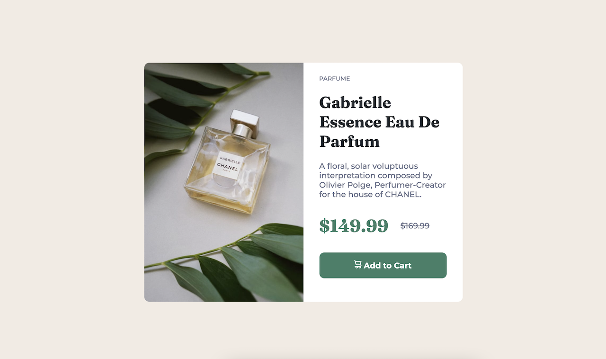
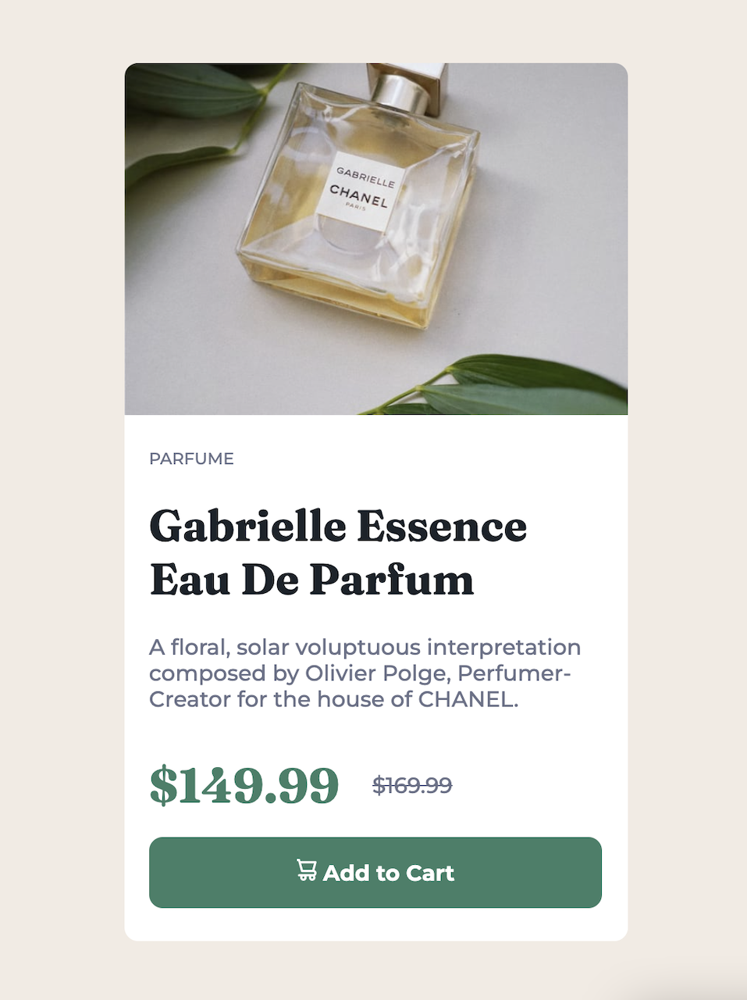

# Frontend Mentor - Product preview card component solution

This is my solution to the [Product preview card component challenge on Frontend Mentor](https://www.frontendmentor.io/challenges/product-preview-card-component-GO7UmttRfa).

## Table of contents

- [Overview](#overview)
  - [The challenge](#the-challenge)
  - [Screenshot](#screenshot)
  - [Links](#links)
- [My process](#my-process)
  - [Built with](#built-with)
  - [What I learned](#what-i-learned)
  - [Continued development](#continued-development)
  - [Useful resources](#useful-resources)
- [Author](#author)
- [Acknowledgments](#acknowledgments)

## Overview

I build both the mobile and desktop version of the product preview card design by Frontend Mentor. Completely responsive, built with CSS & Sass and HTML only.

### The challenge

Users should be able to:

- View the optimal layout depending on their device's screen siz
- See hover and focus states for interactive elements

### Screenshot




### Links

- Solution URL: [My Solution](https://www.frontendmentor.io/solutions/responsive-product-preview-card-cjYeueNf0c)
- Live Site URL: [Live Website](https://c-zltv.github.io/product-preview-card-built-responsive)

## My process

I created the card using the mobile first approach. Also used mostly percenges and rem values as opposed to fixed px values in oreder to make the website more responive even before using @media. With desktop @media I used flexbox to make the top and bottom part of the card parallel and imposed a min() function for the max-width and percenge with related to the screen size.

### Built with

- Semantic HTML5 markup
- CSS custom properties
- Flexbox
- CSS Grid
- Mobile-first workflow
- [Sass](https://sass-lang.com/) - CSS extension language

### What I learned

Used this project to implemet some of the concepts and practices I've read a lot about but never actually got to implement into a real project. Some of these include images inside buttons and the picture tag with multiple source images.

```html
<picture>
  <source media="(min-width:750px)" srcset="images/image-product-desktop.jpg" />
  <source media="(max-width:749px)" srcset="images/image-product-mobile.jpg" />
  
</picture>
```

```html
<button class="product--cart-btn">
  <a href="#">
    
    Add to Cart
  </a>
</button>
```

## Author

- Website - [Cristina Zlatov]
- Frontend Mentor - [@C-ZLTV](https://www.frontendmentor.io/profile/C-ZLTV)
- Twitter - [@czltv](https://twitter.com/czltv)
